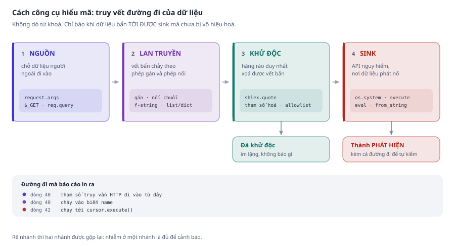
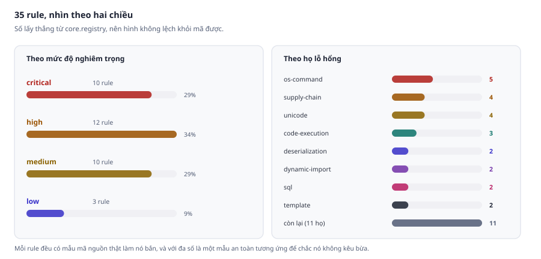
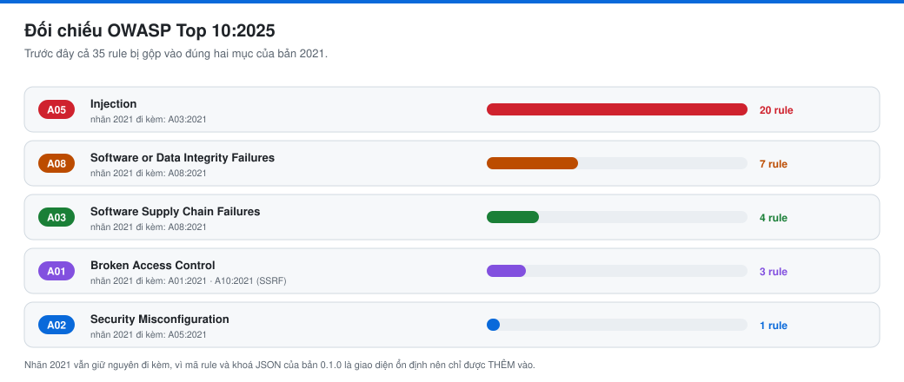
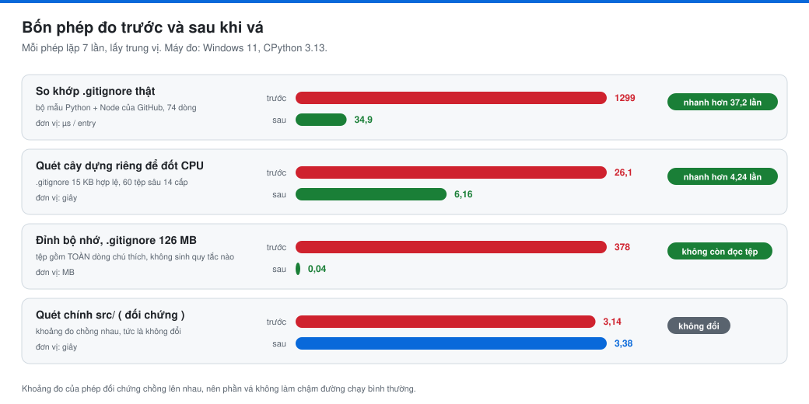
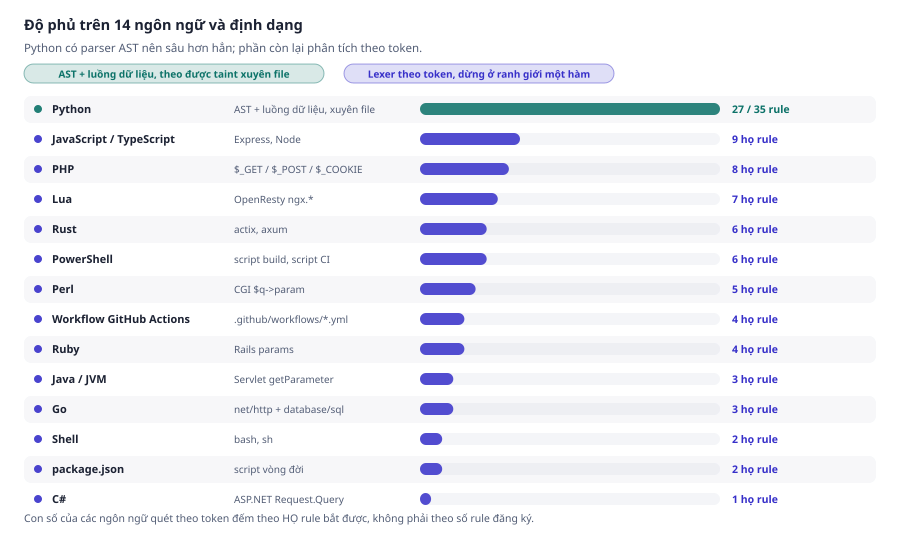
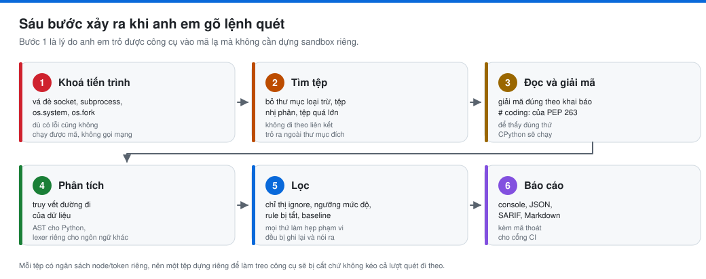
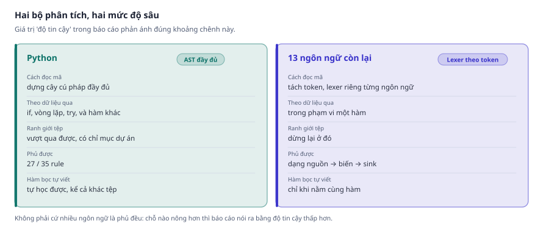

<div align="center">

# 🛡️ Fortress Scan Basic Injection

**Công cụ phân tích tĩnh phát hiện sớm lỗ hổng injection trong mã nguồn.**
Giao diện và báo cáo **hoàn toàn bằng tiếng Việt** cho anh em.

[](CHANGELOG.md)
[](LICENSE)
[](https://www.python.org/)
[](pyproject.toml)

[](#-35-rule-trên-17-họ-injection)
[](#-35-rule-trên-17-họ-injection)
[](#-quét-được-những-dự-án-nào-)
[](tests/)
[](#-đối-chiếu-owasp-top-102025)
[](#-chỉ-đọc-và-in-báo-cáo-không-làm-gì-khác-)

</div>

---

## ⚡ Bắt đầu trong 30 giây

```bash
git clone https://github.com/fortress07/fortress-scan-basic-injection
cd fortress-scan-basic-injection
pip install -e .

python -m fortress_scan ./du-an-cua-toi -v
```

Kết quả trông như thế này:

```
app/routes.py
   CRIT  42:4   Dữ liệu không tin cậy được nối thẳng vào câu lệnh SQL
        tham số truy vấn HTTP chạy tới cursor.execute() mà chưa được vô hiệu hóa
        FSB-SQL-001 | độ tin cậy high | CWE-89
        cursor.execute(f"SELECT * FROM users WHERE name = '{name}'")
        đường đi của dữ liệu:
          dòng 40  tham số truy vấn HTTP đi vào từ đây
          dòng 40  chảy vào biến name
          dòng 42  chạy tới cursor.execute()
```

> [!NOTE]
> Fortress Scan **không dò từ khoá** kiểu grep tên hàm. Nó truy ngược **đường đi của dữ liệu**
> từ nơi đi vào tới nơi phát nổ, rồi in ra cả đường đi để anh em tự kiểm chứng.

---

## 🎯 Công cụ này làm gì

<picture>
  <source media="(prefers-color-scheme: dark)" srcset="docs/img/taint-flow-dark.svg">
  
</picture>

Chỉ khi dữ liệu bẩn **tới được sink mà chưa bị vô hiệu hoá** thì mới thành một phát hiện, và báo
cáo in ra **cả đường đi** để anh em tự kiểm chứng chứ không bắt phải tin tuyệt đối.

---

## 📊 Bản 0.1.0 bằng những con số

<table>
<tr>
<td align="center"><b>35</b><br/><sub>rule</sub></td>
<td align="center"><b>17</b><br/><sub>họ injection</sub></td>
<td align="center"><b>14</b><br/><sub>ngôn ngữ &amp; định dạng</sub></td>
<td align="center"><b>1185</b><br/><sub>kiểm tra tự động</sub></td>
<td align="center"><b>0</b><br/><sub>phụ thuộc ngoài</sub></td>
</tr>
</table>

<picture>
  <source media="(prefers-color-scheme: dark)" srcset="docs/img/rules-dark.svg">
  
</picture>

---

## 🛡️ Đối chiếu OWASP Top 10:2025

Bản 0.1.0 gắn nhãn theo **OWASP Top 10:2025**, và giữ luôn nhãn **2021** đi kèm vì nhiều nơi
( báo cáo tuân thủ, bảng điều khiển code scanning ) vẫn đang tính theo bản cũ. Cả hai đều có mặt
trong JSON và SARIF nên anh em lọc theo bản nào cũng được.

<picture>
  <source media="(prefers-color-scheme: dark)" srcset="docs/img/owasp-2025-dark.svg">
  
</picture>

| OWASP Top 10:2025 | Rule của Fortress Scan | Nhãn 2021 đi kèm |
| :--- | :--- | :--- |
| 🟣 **A01 Broken Access Control** | `FSB-PATH-001` · `FSB-REDIR-001` · `FSB-SSRF-001` | A01:2021, và A10:2021 cho SSRF |
| 🔵 **A02 Security Misconfiguration** | `FSB-XML-001` ( XXE ) | A05:2021 |
| 🟢 **A03 Software Supply Chain Failures** | `FSB-SUP-001` · `FSB-SUP-002` · `FSB-CI-003` · `FSB-CI-004` | A08:2021 |
| 🔴 **A05 Injection** | 20 rule: SQL, OS command, code, template, LDAP, XPath, NoSQL, XSS, EL, reflection, header, file inclusion, CI expression | A03:2021 |
| 🟠 **A08 Software or Data Integrity Failures** | `FSB-DESER-*` · `FSB-UNI-*` · `FSB-IMPORT-002` | A08:2021 |

> [!IMPORTANT]
> **Ba chỗ bản 2025 xếp khác hẳn bản 2021**, và đó chính là lý do phải cập nhật:
> **SSRF** thôi đứng riêng ( A10:2021 ) và về chung với Broken Access Control;
> **chuỗi cung ứng** tách hẳn thành một mục riêng thay vì nấp trong A08;
> còn **path traversal** và **open redirect** về đúng nhà A01 thay vì bị gộp chung vào Injection.

---

## 🧪 Công cụ tự soi lại chính nó

Một bộ dò lỗ hổng mà tự nó thủng thì tệ hơn là không có, vì nó còn kèm theo một tờ giấy chứng nhận
"sạch". Nên bản 0.1.0 dành hẳn một vòng để **tự tấn công mình** theo đúng mô hình đe doạ của người
dùng: kẻ tấn công không chạy được mã trên máy anh em, nhưng đặt được nội dung vào một repo rồi nhờ
anh em quét nó.

<picture>
  <source media="(prefers-color-scheme: dark)" srcset="docs/img/benchmarks-dark.svg">
  
</picture>

Vòng này tìm ra **bốn chỗ**, và ba trong bốn nằm đúng ở phần công cụ tự nhận là đã siết:

| Lỗ hổng | Kích hoạt bằng | Đã vá bằng |
| :--- | :--- | :--- |
| 🔴 **Đọc trọn tệp ignore vào RAM** | một `.gitignore` gồm toàn dòng chú thích, không sinh quy tắc nào | trần kích thước đứng **trước** phép đọc |
| 🔴 **Chi phí so khớp không có trần cộng dồn** | một `.gitignore` 15 KB hợp lệ về mọi mặt | lọc trước chính xác, cộng hạn mức chung cho cả lượt quét |
| 🟠 **Tiêm chuỗi thoát vào terminal** | đặt tên tệp kèm `U+202E` hoặc `\x1b[2K` | trung hoà tên tệp trước khi đưa cho `ast.parse()` |
| 🟠 **Mười đường lách tắt cảnh báo** | chỉ thị giấu trong `%q{}` của Ruby, `<<eot` của Perl | mô tả đúng hai dạng chuỗi đó cho bộ mặt nạ |

> [!NOTE]
> Chỗ thứ hai hoá ra **không chỉ là chuyện an ninh**. Một `.gitignore` bình thường cũng đang tốn
> quá nhiều công so khớp, nên phép vá làm lượt quét của **mọi người** nhanh hơn **37 lần** ở khâu
> đó, chứ không riêng lúc bị tấn công. Phép đo đối chứng ( quét chính `src/` ) có khoảng đo chồng
> lên nhau, tức là phần vá không làm chậm đường chạy bình thường.

Cả bốn đều có kiểm tra hồi quy, và phép lọc trước còn bị khoá thêm bằng một bài đối chiếu
**3.000 cặp mẫu và đường dẫn ngẫu nhiên** với chính bảng quy hoạch động, để chắc nó là tối ưu chứ
không phải một luật khớp mới.

---

## 🔍 35 rule trên 17 họ injection

Mỗi rule dưới đây đều có **mẫu mã nguồn thật làm nó bắn**, và với đa số là **một mẫu an toàn
tương ứng** để chắc nó không kêu bừa. Tất cả chạy tự động trong `tests/test_rule_coverage.py`,
nên bảng này không thể lệch khỏi code.

| Họ lỗ hổng | Rule | Ví dụ bắt được |
| :--- | :--- | :--- |
| **OS command injection** | 🔴 `FSB-CMD-001` · 🟠 `-002` · 🟡 `-003` · 🟡 `-004` | `os.system("ping " + input_ng)` |
| **SQL injection** | 🔴 `FSB-SQL-001` · 🟡 `-002` | `cursor.execute(f"... WHERE n='{ten}'")` |
| **Code injection** | 🔴 `FSB-EXEC-001` · 🟡 `-002` | `eval(payload)`, `exec(payload)` |
| **Template injection ( SSTI )** | 🔴 `FSB-TMPL-001` · 🟡 `-002` | `jinja_env.from_string(tpl_nguoi_dung)` |
| **Dynamic import / file inclusion** | 🔴 `FSB-IMPORT-001` · 🔵 `-002` | `include($_GET['page'])` |
| **Giải tuần tự không an toàn** | 🔴 `FSB-DESER-001` · 🟡 `-002` | `pickle.loads(body)` |
| **Expression language** | 🔴 `FSB-EL-001` | SpEL `parser.parseExpression(q).getValue()` |
| **NoSQL injection** | 🟠 `FSB-NOSQL-001` | `{"$where": gia_tri_ng}` |
| **LDAP injection** | 🟠 `FSB-LDAP-001` | `conn.search_s(base, scope, filter_ng)` |
| **XPath injection** | 🟠 `FSB-XPATH-001` | `tree.xpath("//user[@n='" + ten + "']")` |
| **Reflection** | 🟠 `FSB-REFL-001` | `getattr(os, ten_ham_tu_input)` |
| **XSS / xuất HTML thô** | 🟠 `FSB-XSS-001` | `el.innerHTML = req.body.bio` |
| **XXE** | 🟠 `FSB-XML-001` | `XMLParser(resolve_entities=True)` |
| **Trojan Source / ký tự ẩn** | 🟠 `FSB-UNI-001` · 🟡 `-002` · 🔵 `-003` · 🟡 `-004` | ký tự đảo chiều bidi, ký tự rộng bằng không |
| **Supply chain** | 🔴 `FSB-SUP-001` · 🔵 `-002` | `postinstall` tải script từ xa về chạy |
| **Path traversal** | 🟠 `FSB-PATH-001` | `open('/data/' + ten_tu_input)` |
| **SSRF** | 🟠 `FSB-SSRF-001` | `requests.get(url_tu_input)` |
| **Open redirect** | 🟡 `FSB-REDIR-001` | `flask.redirect(request.args['next'])` |
| **CRLF / header phản hồi** | 🟠 `FSB-HDR-001` | `resp.headers['X-Trace'] = gia_tri_ng` |
| **Injection trong workflow CI** | 🔴 `FSB-CI-001` · 🔴 `-002` · 🟠 `-003` · 🟡 `-004` | `run: echo "${{ github.event.issue.title }}"` |

<sub>🔴 critical · 🟠 high · 🟡 medium · 🔵 low</sub>

Xem đầy đủ bằng `python -m fortress_scan --list-rules`, và giải thích từng rule bằng
`python -m fortress_scan --explain FSB-SQL-001`.

---

## 🌐 Quét được những dự án nào ?

Python có parser AST cộng phân tích luồng dữ liệu nên **sâu hơn hẳn**. Các ngôn ngữ còn lại phân
tích theo token nên chỉ bắt được dạng "nguồn → biến → sink" trong cùng một hàm.

<picture>
  <source media="(prefers-color-scheme: dark)" srcset="docs/img/languages-dark.svg">
  
</picture>

<details>
<summary><b>📖 Từng ngôn ngữ bắt được cụ thể những gì ( bấm để mở )</b></summary>

<br/>

| Ngôn ngữ | Bắt được |
| :--- | :--- |
| 🐍 **Python** <sub>Flask, Django, FastAPI</sub> | command, SQL, code, template, import, deser, NoSQL, LDAP, XPath, reflection, XSS, XXE, unicode, path, SSRF, redirect, header |
| 🟨 **JavaScript / TypeScript** <sub>Express, Node</sub> | command, `eval`, SQL, dynamic `require`, XSS, SSRF, redirect, path, header |
| 🐘 **PHP** <sub>`$_GET` / `$_POST`</sub> | command, `eval`, SQL, `include`, `unserialize`, SSRF, path, `header()` |
| 🌙 **Lua** <sub>OpenResty `ngx.*`</sub> | `loadstring`, `os.execute`, `io.popen`, SQL, path, `ngx.redirect` |
| 🦀 **Rust** <sub>actix, axum</sub> | command, SQL, path, SSRF, template, nạp thư viện động |
| 💠 **PowerShell** <sub>script build, script CI</sub> | `Invoke-Expression`, tạo tiến trình, SQL, `Import-Module`, path, SSRF |
| 🐫 **Perl** <sub>CGI `$q->param`</sub> | command, `eval`, `open` hai đối số, SQL ( DBI ), `Storable::thaw` |
| 💎 **Ruby** <sub>Rails `params`</sub> | command, `eval`, template ( ERB ), `Marshal.load` |
| ⚙️ **Workflow GitHub Actions** | injection biểu thức, pwn request, action ghim bằng nhãn di động |
| ☕ **Java / JVM** <sub>Servlet</sub> | command, SQL, expression language ( SpEL ) |
| 🐹 **Go** <sub>`net/http`</sub> | command, SQL, template |
| 📦 **`package.json`** | script vòng đời tải mã từ xa về chạy |
| 🐚 **Shell** <sub>bash, sh</sub> | `eval`, biến không đặt trong nháy kép |
| 🟦 **C#** <sub>ASP.NET</sub> | SQL |

</details>

<details>
<summary><b>📖 Nguồn dữ liệu Python được nhận ra ( bấm để mở )</b></summary>

<br/>

Từng cái dưới đây mình đã chạy thử và đều ra **critical**:

- `flask.request` với `.args` / `.form` / `.cookies` / `.headers` / `.get_json()` / `.get_data()`
- `request.GET` và `request.POST` của Django
- Tham số handler của FastAPI
- `input()`, `sys.stdin.readline()`
- Phản hồi của `requests` và `urllib.request.urlopen()`

**Mặc định tắt** vì hay báo nhầm, bật bằng `--include-env-sources`:
biến môi trường ( `os.getenv` ) và tham số dòng lệnh ( `argparse` ). Bật lên thì chúng cũng
lên critical.

Đọc từ socket qua biến ( `conn.recv()`, `recvfrom`, `recv_into` ) được nhận ở **mức medium**:
kết nối nội bộ giữa hai dịch vụ của chính mình không nhất thiết là không tin cậy, nên công cụ
không dám khẳng định cứng như `flask.request`.

</details>

---

## 🔒 CHỈ ĐỌC VÀ IN BÁO CÁO, KHÔNG LÀM GÌ KHÁC !

Để đảm bảo tính bí mật về mã nguồn dự án của anh em, Fortress Scan được thiết kế:

| | Cam kết |
| :---: | :--- |
| 🚫 | **Không sửa gì** trong code của anh em |
| 🚫 | **Không ghi file nào**, trừ khi anh em tự yêu cầu bằng `-o` hoặc `--write-baseline` |
| 🚫 | **Không đọc gì** ngoài thư mục anh em chỉ định |
| 🚫 | **Không mở kết nối mạng**, không telemetry, không kiểm tra cập nhật |
| 🚫 | **Không chạy hay import** mã được quét, chỉ phân tích cú pháp |
| ✅ | **Không phụ thuộc thư viện ngoài**, các module đều thuộc thư viện chuẩn Python |

Ngay khi khởi động, công cụ **vá đè** `socket`, `subprocess`, `os.system`, `os.fork` và họ hàng
của chúng, nên mọi nỗ lực gọi mạng hay tạo tiến trình đều ném lỗi. Đây là lý do anh em trỏ nó vào
mã lạ mà không cần dựng sandbox riêng.

---

## 🚦 Cách dùng

```bash
python -m fortress_scan .                         # quét thư mục hiện tại
python -m fortress_scan ./src -v                  # kèm đường đi dữ liệu và cách khắc phục
python -m fortress_scan . --min-severity high     # chỉ xem lỗi nặng
python -m fortress_scan . -f markdown -o BAO-CAO.md
python -m fortress_scan --explain FSB-SQL-001     # vì sao rule này là lỗ hổng, và sửa thế nào

# Chỉ soi phần vừa đổi, dùng cho cổng CI trên pull request
git diff --unified=0 origin/main... > changes.patch
python -m fortress_scan . --diff changes.patch --fail-on-confidence high
```

Sau khi cài còn có hai lệnh gõ tắt là `fortress-scan` và `fscan`. Nếu shell báo không tìm thấy
lệnh ( thư mục `Scripts` của Python chưa có trong PATH ), cứ dùng `python -m fortress_scan`.

**Thử với bộ mẫu có sẵn:**

```bash
python -m fortress_scan tests/samples/vulnerable --no-config -v   # phải ra 48 phát hiện, 26 critical
python -m fortress_scan tests/samples/safe --no-config            # phải im lặng
```

Hai thư mục trên có **cùng chức năng**, chỉ khác ở chỗ một bên viết an toàn.

**Mã thoát cho CI:**

| Mã | Nghĩa |
| :---: | :--- |
| `0` | sạch |
| `1` | có phát hiện |
| `2` | sai cách dùng |
| `3` | lỗi nội bộ |

---

## 🧠 Cách hoạt động

Khi gõ lệnh quét thì có sáu bước xảy ra:

<picture>
  <source media="(prefers-color-scheme: dark)" srcset="docs/img/pipeline-dark.svg">
  
</picture>

### Hai bộ phân tích

<picture>
  <source media="(prefers-color-scheme: dark)" srcset="docs/img/analyzers-dark.svg">
  
</picture>

Rẽ nhánh thì hai nhánh được **gộp lại** ( nhiễm ở một nhánh là đủ để cảnh báo ), vòng lặp chỉ chạy
vài vòng rồi dừng, và mỗi tệp có **ngân sách** số node/token nên một tệp dựng riêng để làm treo
công cụ sẽ bị cắt chứ không kéo cả lần quét đi theo.

<details>
<summary><b>📖 Khi gặp liên kết ( symlink / junction ) thì sao ? ( bấm để mở )</b></summary>

<br/>

Mặc định công cụ **không đi theo liên kết**, gặp cái nào bỏ cái đó. Bật `--follow-symlinks` thì nó
đi theo, nhưng **chỉ những liên kết có đích nằm trong thư mục đang quét**. Đích trỏ ra ngoài bị
chặn và ghi vào báo cáo dưới mã `link-escapes-root`. Liên kết vòng ( a trỏ b, b trỏ a ) cũng bị
chặn ở đây chứ không làm treo lượt quét.

Ba điều anh em nên biết khi bật cờ này:

- Cùng một tệp tới được qua nhiều tên chỉ được **quét một lần**, nên workspace kiểu pnpm ( vốn là
  cả một rừng symlink ) không làm phát hiện bị nhân bản.
- Phát hiện nằm dưới một thư mục được liên kết sẽ báo theo **đường dẫn thật**, vì đó mới là chỗ
  tệp thực sự nằm.
- Liên kết trỏ vào thư mục vốn bị loại trừ ( `vendor`, `node_modules`, `dist` ) thì **vẫn được
  quét**. Đi theo liên kết là quyết định của anh em, nên ở đây công cụ chọn quét sót ít hơn là
  im lặng bỏ qua.

Những tệp công cụ tự đi tìm trong cây được quét ( `.fortress-scan.json`, `.fortress-scanignore`,
`.gitignore` ) thì **không bao giờ được đọc xuyên qua một liên kết**, kể cả khi `--follow-symlinks`
đang bật. Tệp cấu hình anh em tự trỏ tới bằng `--config` thì không dính luật này, vì đó là lựa
chọn của anh em.

Ngoài ra, giữa lúc liệt kê cây và lúc mở tệp ra đọc luôn có một khoảng trống. Ai ghi được vào cây
đang bị quét có thể tráo tệp ngay trong khoảng đó. Công cụ đối chiếu lại **trên chính handle đã
mở** ( chứ không kiểm lại đường dẫn ), tệp nào bị tráo thì bỏ và ghi vào báo cáo dưới mã
`file-changed-during-scan`.

</details>

---

## ⚠️ GIỚI HẠN, xin đọc kỹ trước khi tin kết quả

> [!WARNING]
> ### Công cụ đưa ra **GỢI Ý**, không phải tin tuyệt đối
> ### Công cụ đưa ra **GỢI Ý**, không phải tin tuyệt đối
> ### Công cụ đưa ra **GỢI Ý**, không phải tin tuyệt đối
>
> Cái nào quan trọng nhắc lại 3 lần !
>
> **Mọi kết quả cần được anh em tự xem xét và quyết định hướng xử lý.**
>
> Công cụ **KHÔNG cam đoan** rằng sửa theo gợi ý là đã vá xong lỗ hổng.
> Công cụ **KHÔNG cam đoan** đã tìm ra hết mọi lỗ hổng trong mã của anh em.

Một báo cáo sạch là *bằng chứng tốt*, **không phải chứng minh là an toàn**. Hãy coi nó như một
người rà soát thêm, không phải một chứng nhận bảo mật.

### Phạm vi hoạt động

Công cụ neo vào **tên API của thư viện** ( `os.system`, `$_GET`, `cursor.execute` ), những cái tên
cố định. Vì vậy:

| Tình huống trong code của anh em | Kết quả |
| :--- | :--- |
| Đặt tên biến/hàm bằng tiếng Việt, Trung, Nhật ( kể cả có dấu ) | ✅ Không ảnh hưởng gì |
| Đổi tên thư viện, ví dụ `import os as he_dieu_hanh` | ✅ Vẫn bắt được |
| Gán sink vào biến rồi gọi, ví dụ `chay = os.system; chay(cmd)` | ✅ Vẫn bắt được |
| Sink nằm trong bảng điều phối, ví dụ `handlers["run"](cmd)` | ✅ Vẫn bắt được |
| Gọi qua `getattr` với tên hằng, ví dụ `getattr(os, "system")(cmd)` | ✅ Vẫn bắt được |
| Hàm bọc / tầng CSDL tự viết, **cùng tệp** | ✅ Tự học được, mức critical |
| Hàm bọc / tầng CSDL tự viết, **khác tệp trong dự án** ( Python ) | ✅ Tự học được qua chỉ mục dự án, kèm đường đi xuyên file |
| Framework hoặc helper lấy input tự viết mà công cụ chưa biết | ⚠️ Chỉ còn mức medium |
| Wrapper nằm trong **thư viện ngoài** ( cài qua pip ) | ❌ Bỏ sót |

> **Ngôn ngữ anh em dùng để đặt tên không quan trọng. Cái quyết định là wrapper của anh em nằm ở đâu.**

<details>
<summary><b>📖 Các giới hạn khác, nói thẳng ( bấm để mở )</b></summary>

<br/>

- **Python theo được taint xuyên file**: nguồn ở `a.py` chạy qua helper ở `b.py` rồi nổ ở `c.py`
  vẫn được nối, với chặn trên 2000 tệp / 20000 hàm mỗi lượt quét. **Các ngôn ngữ quét theo token
  thì vẫn dừng ở ranh giới tệp.**
- **Bộ quét theo token không nhìn xuyên qua thân `match` / `switch`.** Nó cắt câu lệnh ở dấu `{`,
  nên `let dich = match ten { "a" => HANG_A, _ => HANG_B };` có thể ra một báo nhầm mức medium.
  Đây là lựa chọn CÓ CHỦ Ý theo hướng an toàn: đoán ngược lại thì `_ => ten`, một lỗ hổng thật,
  sẽ biến mất trong im lặng.
- **Ngoài Python là phân tích theo token**, không phải parser đầy đủ. Độ bao phủ thấp hơn, và giá
  trị "độ tin cậy" trong báo cáo phản ánh đúng điều đó.
- **Không theo được dữ liệu lưu vào thuộc tính đối tượng**, và không phát hiện **injection bậc
  hai** ( dữ liệu bẩn ghi vào CSDL rồi đọc ra dùng lại ).
- **Workflow CI đọc bằng bộ quét theo dòng, không phải bộ phân tích YAML đầy đủ**: neo và alias
  ( `*ref` ), luồng kiểu JSON ( `run: {a: b}` ) và biểu thức đi xuyên qua ranh giới của một action
  tự viết đều nằm ngoài tầm nhìn. Đây là đánh đổi để giữ đúng lời hứa "không phụ thuộc thư viện
  ngoài" mà không tự viết thêm một mặt tấn công ( alias bung vô hạn ) vào chính công cụ.
- **Kiểu viết trên nhiều dòng hoặc có `;` bên trong kiểu dữ liệu thì chưa tách câu lệnh đúng**,
  ví dụ TypeScript `const o: {a: string; b: number} = nguon_ng` bị cắt câu ngay dấu `;`, nên chỉ
  còn cảnh báo mức medium.
- **Chưa hỗ trợ**: log injection, prototype pollution, ReDoS, lỗi logic nghiệp vụ. Vị trí
  `response['X-Header'] = v` của Django ( không có chữ `headers` ) chưa bắt được.
- Sẽ có **báo nhầm** và **bỏ sót**, phân tích tĩnh vốn không đầy đủ. Công cụ **bổ sung** cho code
  review, quét phụ thuộc và kiểm thử động, **không thay thế** cái nào hết.

</details>

### 🖥️ Nền tảng

| Nền tảng | Trạng thái |
| :--- | :--- |
| 🪟 **Windows 11** | ✅ Phát triển và kiểm thử đầy đủ |
| 🐧 **Linux** | ⚠️ Chưa chạy thử thực tế, xin coi là bản thử nghiệm |
| 🍎 **macOS** | ⚠️ Chưa chạy thử thực tế, xin coi là bản thử nghiệm |

Mã nguồn viết theo hướng đa nền tảng và nhiều khả năng chạy bình thường, nhưng **chưa có bằng
chứng thực nghiệm**. Sắp tới mình sẽ qua research bên Linux để kiểm tra kĩ hơn. Thú thật với mọi
người là phần này mình có thiết kế cho AI viết để đảm bảo tránh xung đột hệ điều hành.

---

## 🕵️ Khi quét mã không đáng tin

Chú thích `fortress-scan: ignore`, tệp `.fortress-scan.json`, `.fortress-scanignore` và `.gitignore`
đều nằm **trong chính mã được quét**, nên người viết mã có thể dùng chúng để giấu phát hiện. Khi
review code lạ, hãy tắt cả bốn đường đó:

```bash
python -m fortress_scan <duong-dan> \
    --no-inline-suppressions \
    --no-config \
    --no-ignore-files \
    --no-vcs-ignore
```

| Cờ | Vô hiệu hoá |
| :--- | :--- |
| `--no-inline-suppressions` | mọi chú thích `fortress-scan: ignore*` trong mã |
| `--no-config` | tệp `.fortress-scan.json` |
| `--no-ignore-files` | tệp `.fortress-scanignore` |
| `--no-vcs-ignore` | tệp `.gitignore` |

Có **ba** phạm vi chú thích, không chỉ một. `ignore-file` giấu được **cả tệp** nên đáng chú ý nhất
khi đọc mã lạ:

| Chú thích | Che |
| :--- | :--- |
| `# fortress-scan: ignore` | đúng dòng đang viết |
| `# fortress-scan: ignore-next-line` | dòng ngay bên dưới |
| `# fortress-scan: ignore-file` | **toàn bộ tệp** |

Giới hạn theo rule bằng `# fortress-scan: ignore [FSB-CMD-001]`.

> [!TIP]
> **Chỉ thị nằm trong chuỗi không được tính.** `HELP = "# fortress-scan: ignore-file"` chỉ là dữ
> liệu, không tắt gì hết. Đây là họ lỗ hổng dai dẳng nhất của cả dự án: bản 0.1.0 phải quay lại
> bịt nó nhiều đợt, trên gần như mọi ngôn ngữ được hỗ trợ.

<details>
<summary><b>📖 Vì sao chuyện "chỉ thị trong chuỗi" lại khó đến thế ( bấm để mở )</b></summary>

<br/>

**Nửa thứ nhất: đâu là chú thích thật.** Dùng chung một danh sách dấu mở chú thích cho mọi ngôn
ngữ là một đường lách thật, vì mỗi dấu trong đó lại là **toán tử hợp lệ** ở ngôn ngữ khác: `//` là
phép chia nguyên của Python, `--` là toán tử giảm của JS/Java/C#/PHP, `#` là trường riêng tư của
JavaScript, còn `a <!--b` là `a < !(--b)` ở cả bốn ngôn ngữ họ C.

Thế là những dòng dưới đây, **không dòng nào có lấy một chú thích**, từng tắt sạch phát hiện của
cả tệp:

```python
mid = (lo + hi) // 2 ; NOTE = "# fortress-scan: ignore-file"      # Python
```
```javascript
let i = 5; i--; const NOTE = "// fortress-scan: ignore-file";     // JavaScript
```
```bash
curl http://example.com/#frag; MSG="# fortress-scan: ignore-file" # Shell
```

| Ngôn ngữ | Được coi là mở chú thích |
| :--- | :--- |
| Python, Ruby | `#` |
| Shell | `#`, và phải đứng đầu một từ |
| JavaScript, TypeScript, Java/JVM, C#, Go | `//`, `/* */` |
| PHP | `//`, `#`, `/* */` |
| Lua | `--` |

**Nửa thứ hai: chuỗi kết thúc ở đâu.** Bộ mặt nạ đóng chuỗi sớm hơn ngôn ngữ thật một dòng thôi là
đủ: phần thân còn lại vẫn là nội dung chuỗi với trình thông dịch, nhưng với công cụ thì đã thành
mã, và một dấu `#` trong đó mở ra một "chú thích" mang theo `ignore-file`.

```python
"""tài liệu
ví dụ \""" ở đây
# fortress-scan: ignore-file
"""
```
```ruby
n = %q{# fortress-scan: ignore-file}
```
```perl
my $n = <<eot;
# fortress-scan: ignore-file
eot
```

| Dạng chuỗi | Ngôn ngữ | Kết thúc ở |
| :--- | :--- | :--- |
| `"..."` `'...'` | Python, JS/TS, Java, C#, Go | cuối dòng, trừ khi có `\` nối dòng |
| `"..."` `'...'` | PHP, Ruby, shell | dấu nháy đóng, **bắc qua bao nhiêu dòng cũng được** |
| `` `...` `` | JS/TS, Go | dấu backtick đóng, bắc qua dòng |
| `@"..."` | C# | dấu nháy đóng, bắc qua dòng |
| `"""..."""` `'''...'''` | Python, Java text block, C# raw string | dấu ba nháy đóng **chưa bị `\` thoát** |
| `<<<EOT` `<<~EOT` `<<EOF` | PHP, Ruby, shell, Perl | dòng chỉ có đúng nhãn kết thúc |
| `[[...]]` `[=[...]=]` | Lua | dấu ngoặc đóng đối ứng |
| `@"..."@` `@'...'@` | PowerShell | dấu đóng here-string |
| `%q{}` `%Q()` `%w[]` `q()` `qq()` | Ruby, Perl | dấu đóng do chính người viết chọn |

</details>

### Khi phạm vi quét bị thu hẹp, báo cáo phải nói ra

Nếu anh em quên tắt: khi `.fortress-scan.json` trong cây được quét làm hẹp phạm vi ( tắt rule,
loại trừ đường dẫn, nâng ngưỡng ), công cụ **nói rõ nó đã tắt những gì**. Một báo cáo "sạch" sinh
ra từ cấu hình của người khác sẽ không im lặng nữa.

`.gitignore` và `.fortress-scanignore` cũng vậy: hễ chúng gỡ được **tệp mã nguồn** nào ra khỏi
lượt quét thì báo cáo nói ra số tệp và số thư mục bị gỡ. Một dòng `app/session.py` trong
`.gitignore` là đủ để giấu đúng cái tệp có lỗ hổng, nên chỗ này không được im.

Quan trọng là cảnh báo này **có mặt ở mọi định dạng**, không riêng màn hình:

| Định dạng | Cảnh báo nằm ở |
| :--- | :--- |
| console | khối `CẢNH BÁO` ngay trên phần tổng kết, không cần `-v` |
| JSON | mảng `notices` ở cấp cao nhất |
| SARIF | `runs[].invocations[].toolExecutionNotifications` |
| Markdown | mục `⚠️ Phạm vi quét đã bị thu hẹp`, đặt trước phần phát hiện |

Muốn CI chặn hẳn thì thêm `--fail-on-coverage-reduction`: hễ có thứ gì làm hẹp phạm vi quét là
thoát `1`, kể cả khi không tìm ra lỗi nào. Mặc định cờ này **tắt**, nên mã thoát của anh em không
đổi nếu không tự bật.

---

## 🎯 Mục đích

Đây là **dự án cá nhân**, viết ra vì mong muốn anh em dev Việt Nam có một công cụ **tiếng Việt**
để soi lại code **trước khi đưa lên production**.

Nó tồn tại như **một lớp tham khảo thêm** bên cạnh việc tự review, mà không phải tìm một người
khác pentest hoặc thậm chí phải dùng AI agent để scan lại ( làm tốn token quý giá của anh em ).
Không cần cấu hình, chỉ ra chỗ đáng ngờ kèm đường đi của dữ liệu, rồi phần còn lại toàn quyền xử
lý của anh em.

---

## 🤝 Góp ý và báo lỗi

Do đây là dự án đầu tay của mình nên sẽ không tránh khỏi những thiếu sót, nên hy vọng anh em có
phát hiện gì thì hãy báo với mình qua mail ( **vophuvinh15012007@gmail.com** ) hoặc kênh liên lạc
trực tiếp.

Để chuyên nghiệp hơn xíu thì khi báo lỗi anh em kèm giúp mình:

- 📌 **phiên bản công cụ**
- 💻 **hệ điều hành**
- 🧩 **một đoạn mã tối thiểu tái hiện được lỗi**

để mình hiểu rõ hơn về vấn đề cũng như thuận tiện cho việc fix nhé.

Mình đọc và phản hồi tất cả, chỉ là có thể hơi chậm.

### Chân thành cảm ơn anh em rất nhiều 💚

---

## 👤 Tác giả và lời cảm ơn

Được viết bởi **[fortress07](https://github.com/fortress07)**, là một dự án cá nhân.

Dự án có **sự hỗ trợ của AI** ( Claude ) trong quá trình tham khảo cách triển khai và đẩy nhanh
tiến độ: phác thảo kiến trúc, sinh mã cho các engine phân tích, viết bộ test và soạn tài liệu.
Toàn bộ hướng đi, yêu cầu, quyết định thiết kế và việc kiểm thử đều do mình điều hướng và rà soát.
Mình ghi rõ điều này vì cho rằng người dùng có quyền biết mã họ đang chạy được tạo ra như thế nào.

Cảm ơn anh em đã dành thời gian đọc tới đây và tin dùng Fortress Scan. Nếu công cụ giúp ích được
cho anh em, một ngôi sao ⭐ trên GitHub của mọi người là nguồn động viên rất lớn đối với mình.

---

## 🚀 Phát hành

Anh em nào tự dựng bản phát hành ( hoặc fork về rồi muốn tự đẩy lên ) thì
[`docs/RELEASE.md`](docs/RELEASE.md) có hướng dẫn từng bước: kiểm tra trước khi
phát hành, đẩy nhánh, gắn tag, dựng gói, tạo Release trên GitHub, và cách lùi
lại nếu có gì hỏng.

Hình minh hoạ trong README **được sinh ra chứ không vẽ tay**, nên sửa mã xong
thì chạy lại:

```bash
python tools/generate_diagrams.py
```

Quên chạy thì `tests/test_diagrams.py` sẽ đỏ, kèm đúng câu lệnh cần gõ.

---

## 📄 Giấy phép

[MIT](LICENSE), dùng tự do cho cả mục đích cá nhân và thương mại.

Không được dùng để bán, cung cấp cho các dịch vụ trả phí hoặc các hành vi dùng cho mục đích xấu.
